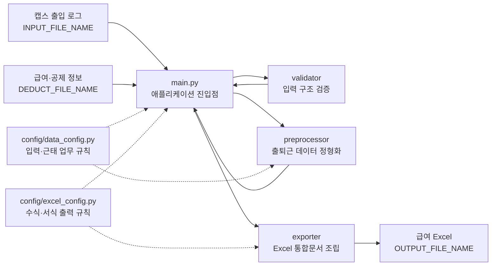
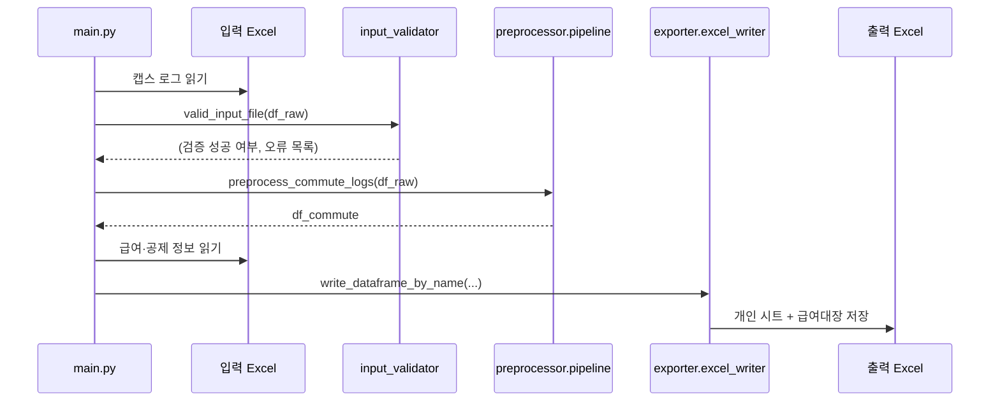
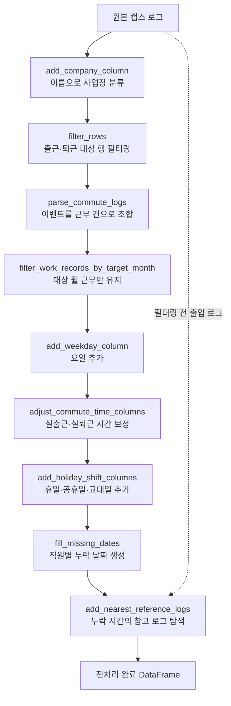
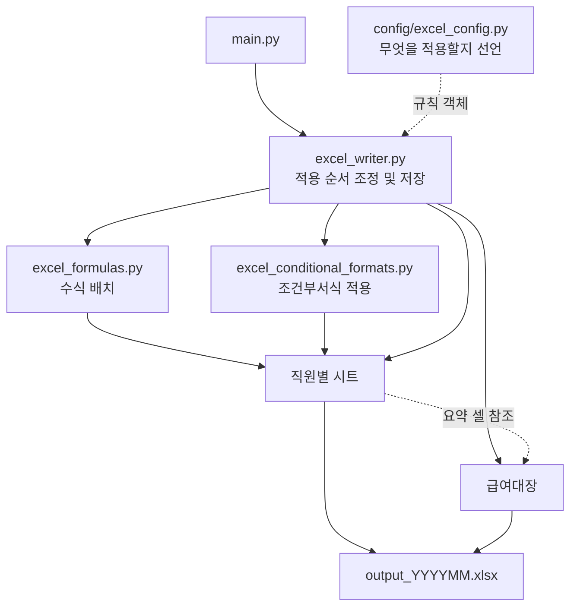

# 태일전선 급여계산 자동화 프로그램

> 태일전선 급여계산 자동화 프로그램은 급여 계산을 자동화하여 효율성을 높이고 오류를 최소화하는 솔루션입니다.  
> 이 프로그램은 수동 작업을 자동화하여 급여 계산 프로세스를 간소화합니다.

------

# 주요 기능
1. **Human error 탐지**: 누락되거나 잘못 입력된 데이터를 자동으로 검증 
2. **출퇴근 로그 파싱 자동화**: 근태 기록 데이터를 자동으로 추출 및 정형화
3. **엑셀 수식 및 레이아웃 자동화**: 계산 수식 반영 및 지정 레이아웃으로 엑셀 파일 출력

# 사용 방법 (WIP)
```bash
python main.py
```

------

# 운영/개발 참고 사항


## Versioning
- **날짜 기반 버저닝 (Calendar Versioning)**
- 형식: `vYY.MM.Patch`
- 개발자 판단하에 2개 이상의 PR 이후에 버전을 올린다.
- 버전 업데이트 기준
  - 새로운 기능 추가
  - 에러 수정
- 버전 업데이트 하지 않는 케이스
  - 단순 주석, README 추가 변경
  - 그 외 매우 사소한 변경
  
## Branch Rule
- `feature/YYMMDD-NN/` 새로운 기능이나 자동화 로직 추가
- `fix/YYMMDD-NN/` 기존 기능의 버그나 계산 수식 오류 수정
- `docs/YYMMDD-NN/` README, 명세서, 주석 등 문서 수정
- `refactor/YYMMDD-NN/` 기능 변경 없는 코드 구조/성능 개선
- `YYMMDD-NN` 작업날짜, 일련번호 (예: 20260801-01)

## PR Rule
- 제목: Branch의 prefix를 대괄호로 감싸고 업데이트 명을 적는다. (예: `[feature] 출퇴근 로그 파싱 자동화`)
- 본문: 변경 사항 요약, 변경 이유, 테스트 방법 등 작성한다.
- 머지 전 스스로 코드리뷰 후 Merge 진행한다.

## Issues Rule
- Title: [Prefix] 제목 (e.g. [feat] 자동 서식 변경 기능 추가)
- Prefix
  - [feat]: 새로운 기능 추가
  - [fix]: 간단한 코드 수정 및 오타 처리
  - [docs]: 문서 작업 (README, API 명세 등)
  - [refactor]: 기능 변경 없는 코드 개선 및 구조 변경

## Release Process
- **작업 시작**: Issues 메뉴에서 새로운 Issue 생성 후 작업 시작
- **브랜치 생성**: master에서 새로운 작업 브랜치 생성 (예: `feature/log-parser` 또는 `fix/excel-bug`)
- **개발 및 커밋**: 개발, 커밋 진행 후 해당 브랜치 푸시
- **Self PR**: GitHub 웹으로 이동하여 master 방향으로 PR을 생성하고, 코드 변경점을 최종 자가 검수 후 Merge
- **태그/릴리스 생성** (GitHub Web):
  - 배포할 시점이 되면 GitHub 웹의 Releases 메뉴로 이동
  - `Draft a new release`를 누르고 새 버전에 맞는 태그(예: `v26.08.01`) 생성 및 변경 사항 요약 작성 후 Publish

  
## Architecture

### 1. 시스템 개요

이 애플리케이션은 두 개의 Excel 입력 파일을 읽어 출퇴근 기록을 정제하고,
직원별 급여 명세 시트와 전체 급여대장이 포함된 Excel 파일을 생성하는
배치 프로그램이다.



의존 방향은 `main.py → validator/preprocessor/exporter`이며 각 하위 계층은
`main.py`를 참조하지 않는다. `config`는 처리 코드와 분리된 정책·설정
계층으로 여러 모듈에서 읽어 사용한다.

### 2. 디렉터리 구조와 책임

```text
payroll/
├── main.py                         # 전체 실행 순서를 조정하는 진입점
├── config/
│   ├── data_config.py              # 대상 월, 컬럼명, 근무 일정, 필터 규칙
│   └── excel_config.py             # Excel 수식, 요약, 조건부서식 규칙
├── validator/
│   └── input_validator.py          # 캡스 입력 DataFrame 최소 요건 검증
├── preprocessor/
│   ├── pipeline.py                 # 전처리 하위 단계를 순서대로 조정
│   ├── raw_cleaner.py              # 행 필터링 및 사업장 분류
│   ├── commute_parser.py           # 출근/퇴근 이벤트를 근무 건으로 조합
│   ├── calendar_enricher.py        # 대상 월, 요일, 휴일, 누락 날짜 처리
│   ├── time_adjuster.py            # 급여 계산용 출퇴근 시간 보정
│   └── reference_matcher.py        # 누락 시간에 출입 참고 로그 연결
└── exporter/
    ├── excel_writer.py             # exporter 최상위 조정자 및 파일 저장
    ├── excel_formulas.py           # Excel 수식 규칙 모델과 적용 도구
    └── excel_conditional_formats.py # 조건부서식 규칙 모델과 적용 도구
```

### 3. 애플리케이션 실행 순서

`main.py`는 다음 순서로 실행된다.



핵심 진입 함수는 다음 두 개다.

| 단계 | 핵심 함수 | 반환값 |
|---|---|---|
| 전처리 | `preprocess_commute_logs(raw_df)` | 급여 계산에 필요한 근무 DataFrame |
| Excel 출력 | `write_dataframe_by_name(df, ...)` | 저장된 파일의 `Path` |

### 4. 입력 검증 계층

`validator/input_validator.py`는 전처리 전에 캡스 로그의 최소 구조를 확인한다.

| 함수 | 역할 |
|---|---|
| `valid_input_file` | 빈 데이터 여부, 필수 컬럼 존재 여부, 필수 컬럼 전체가 공백인지 검사하고 `(ok, errors)` 반환 |
| `_is_blank_series` | 한 컬럼이 전부 결측값 또는 빈 문자열인지 검사하는 내부 함수 |

검증에 사용하는 필수 컬럼은 `config/data_config.py`의
`INPUT_FILE_REQUIRED_COLUMNS`에서 관리한다.

### 5. 전처리 파이프라인

`preprocessor/pipeline.py`의 `preprocess_commute_logs`가 전처리 계층의
최상위 조정자다. 각 단계는 DataFrame을 받아 새로운 DataFrame을 다음
단계로 전달한다.



#### 전처리 모듈별 핵심 함수

| 모듈 | 핵심 함수 | 동작 |
|---|---|---|
| `raw_cleaner.py` | `add_company_column` | 이름 목록을 기준으로 `등록사업장`을 태일전선·태일소재·미등록으로 분류 |
|  | `filter_rows` | `DATA_CLEANER_FILTER_ITEMS`의 include/exclude 규칙으로 불필요한 로그 제거 |
| `commute_parser.py` | `parse_commute_logs` | 사용자별 이벤트를 시간순으로 정렬하고 출근과 최대 24시간 이내 퇴근을 하나의 근무 건으로 조합 |
| `calendar_enricher.py` | `filter_work_records_by_target_month` | `근무일자`가 `TARGET_MONTH`에 속하는 기록만 유지 |
|  | `add_weekday_column` | 근무일자에 한국어 요일 추가 |
|  | `add_holiday_shift_columns` | 주말, 공휴일 설정, 교대일 설정을 0/1 컬럼으로 추가 |
|  | `fill_missing_dates` | 직원별 공통 날짜 범위에서 기록이 없는 날짜 행을 생성 |
| `time_adjuster.py` | `adjust_commute_time_columns` | 원본 출퇴근 시각을 급여 계산 규칙에 따라 시간 단위로 보정 |
| `reference_matcher.py` | `add_nearest_reference_logs` | 출근 또는 퇴근 한쪽이 누락된 기록에 근무 스케줄과 가까운 `출입` 로그를 참고시간으로 연결 |

`calendar_enricher.py`의 `filter_date`와
`filter_before_target_month_start_week`는 보조 날짜 필터이며 현재 기본
파이프라인에서는 호출하지 않는다.

### 6. Excel 출력 계층

`exporter/excel_writer.py`가 출력 계층의 최상위 조정자다.
`excel_formulas.py`와 `excel_conditional_formats.py`는 서로 참조하지 않는
동일한 하위 계층의 도구이며, `excel_writer.py`만 두 모듈을 호출한다.



#### `write_dataframe_by_name` 실행 순서

1. 입력 DataFrame과 수식·서식 규칙을 검증한다.
2. 이름별 개인 워크시트를 생성하고 데이터를 기록한다.
3. 개인 시트에 행별 수식, 조건부서식, 요약 수식을 적용한다.
4. 개인 시트 정보 또는 `df_overall`로 급여대장 기본 행을 만든다.
5. 개인 요약값을 급여대장에 연결하는 수식을 추가한다.
6. 사용자ID를 기준으로 공제 정보를 급여대장 오른쪽에 결합한다.
7. 급여대장 조건부서식과 Excel 테이블을 적용하고 파일을 저장한다.

급여대장은 개인 시트의 실제 요약 셀 주소를 참조한다. 따라서 개인 시트를
먼저 생성하고 급여대장은 나중에 생성한 뒤 워크북의 첫 번째 위치로 옮긴다.

#### 출력 모듈별 핵심 구성요소

| 모듈 | 구성요소 | 동작 |
|---|---|---|
| `excel_writer.py` | `write_dataframe_by_name` | 개인 시트, 급여대장, 공제 데이터, 서식과 저장을 총괄 |
|  | `_make_sheet_title` | Excel 금지 문자·31자 제한·중복을 처리해 안전한 시트명 생성 |
|  | `_to_excel_value` | pandas/numpy 값을 openpyxl이 기록할 수 있는 Python 값으로 변환 |
| `excel_formulas.py` | `FormulaColumn` | 개인 시트의 각 데이터 행에 추가할 수식 열 규칙 |
|  | `SummaryFormula` | 개인 시트 우측의 합계·수당·공제 요약 규칙 |
|  | `OverallFormula` | 급여대장에 추가할 수식 열 규칙. 현재는 사용자ID 기반 개인 요약 lookup에 사용 |
|  | `apply_formula_columns` | 개인 시트의 모든 데이터 행에 수식 열 적용 |
|  | `apply_summary_formulas` | 개인 시트 우측에 제목/값 형태의 요약 영역 생성 |
| `excel_conditional_formats.py` | `ColumnConditionalFormat` | 컬럼명과 openpyxl 조건부서식 `Rule`을 묶는 규칙 객체 |
|  | `apply_column_conditional_formats` | 컬럼명을 실제 Excel 범위로 변환해 조건부서식 적용 |

### 7. 설정 계층과 주요 변경 지점

#### `config/data_config.py`

입력 데이터와 근태 전처리 정책을 관리한다.

| 변경 목적 | 주요 설정 |
|---|---|
| 계산 대상 월 변경 | `TARGET_MONTH` |
| 입력 파일 변경 | `INPUT_FILE_NAME`, `DEDUCT_FILE_NAME` |
| 공휴일·교대일 변경 | `HOLIDAY_DATES`, `SHIFT_DATES` |
| 직원 사업장 변경 | `TAEIL_CABLE`, `TAEIL_MATERIAL` |
| 원본 행 필터 변경 | `DATA_CLEANER_FILTER_ITEMS` |
| 출퇴근 조합 범위 변경 | `MAX_WORK_HOURS` |
| 참고 로그 허용 범위 변경 | `REFERENCE_LOG_TOLERANCE`, `REFERENCE_SHIFT_DETECTION_TOLERANCE` |
| 근무 스케줄 변경 | `REFERENCE_WORK_SCHEDULES` |
| 최종 전처리 컬럼 순서 변경 | `COMMUTE_COLUMN_ORDER` |

#### `config/excel_config.py`

Excel에 무엇을 계산하고 표시할지 선언한다.

| 변경 목적 | 주요 설정 |
|---|---|
| 출력 파일명 변경 | `OUTPUT_FILE_NAME` |
| 개인 일자별 계산식 변경 | `personal_formula_columns` |
| 개인 합계·수당·공제식 변경 | `personal_summary_formulas` |
| 급여대장 lookup 열 변경 | `overall_formula_columns` |
| 이상 데이터 강조 규칙 변경 | `personal_conditional_formats` |

`FormulaColumn`은 선언 순서대로 추가되므로 뒤의 수식이 앞에서 생성된 열을
참조할 수 있다. `SummaryFormula.start_row`는 개인 명세의 요약 배치를
고정하므로 행 위치 변경 시 다른 요약 수식의 참조 관계도 함께 확인해야 한다.

### 8. 주요 데이터 형태

```text
캡스 원본 이벤트
발생일자 | 발생시각 | 사용자ID | 이름 | 모드(출근/퇴근/출입)
                         │
                         ▼
전처리 근무 기록
사용자ID | 이름 | 등록사업장 | 근무일자 | 출근시간 | 퇴근시간
         | 요일 | 실출근시간 | 실퇴근시간 | 휴일 | 공휴일 | 교대일
         | 출근참고시간 | 퇴근참고시간
                         │
                         ▼
개인 Excel 시트
전처리 근무 기록 + 일별 계산 수식 + 개인 합계·수당·공제 요약
                         │
                         ▼
급여대장
개인 요약 lookup 열 + 외부 급여·공제 정보
```

`출근참고시간`과 `퇴근참고시간`은 누락된 실제 기록을 자동으로 대체하지
않는다. 검토할 수 있는 가장 가까운 출입 로그를 별도 컬럼에 제시한다.

### 9. 유지보수 및 인수인계 시 주의사항

- openpyxl은 수식을 저장하지만 계산하지 않는다. 출력 파일을 Excel에서
  열 때 재계산되도록 설정되어 있으므로 Python 실행 직후 수식 캐시 값은
  최신이 아닐 수 있다.
- 컬럼명은 전처리, 수식, 조건부서식 사이의 계약이다. 컬럼명을 바꾸면
  `data_config.py`, `excel_config.py`와 관련 수식 참조를 함께 수정해야 한다.
- 사용자ID는 개인 시트, 급여대장, 공제 정보를 연결하는 키다. 공제 파일을
  읽은 뒤 4자리 문자열로 정규화한다.
- 현재 `main.py`는 입력 검증 실패 메시지를 출력한 뒤에도 전처리를 계속한다.
  운영 안정성이 필요하면 검증 실패 시 실행을 중단하도록 보완해야 한다.
- 현재 `main.py`는 import 시에도 즉시 실행되는 스크립트 구조다. 자동화
  테스트나 다른 프로그램에서 재사용하려면 `main()` 함수와
  `if __name__ == "__main__":` 보호 구문으로 분리하는 것이 좋다.
- 대상 월 변경 시 공휴일, 교대일, 입력 파일명과 출력 파일명도 함께
  검토한다.
- 급여 계산 규칙을 변경할 때는 대표적인 주간·야간·휴일·누락 기록 사례로
  출력 수식과 최종 Excel 계산 결과를 모두 확인한다.
